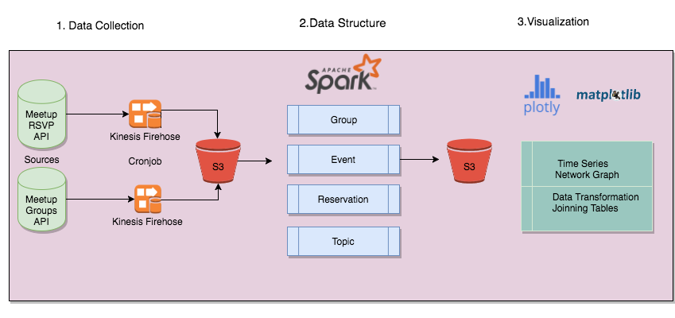
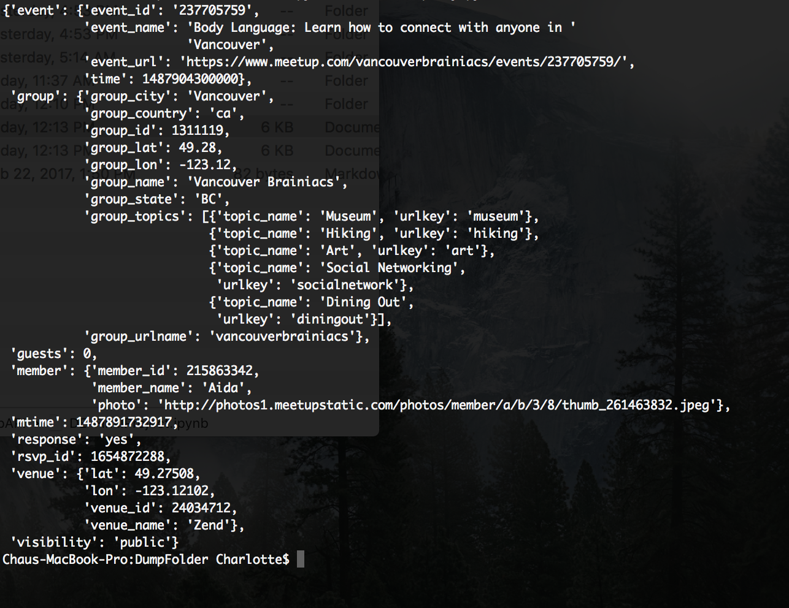
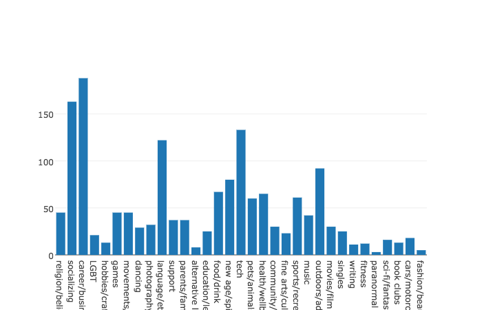
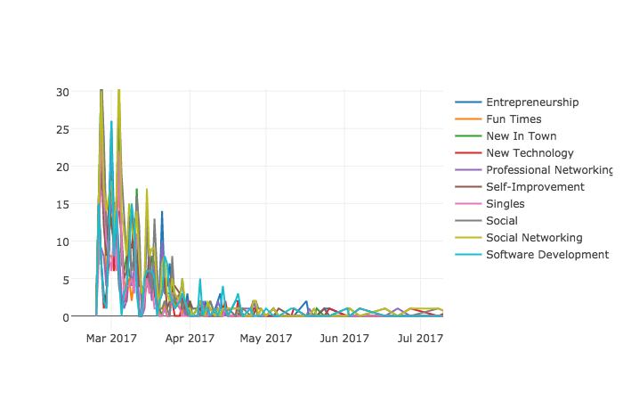
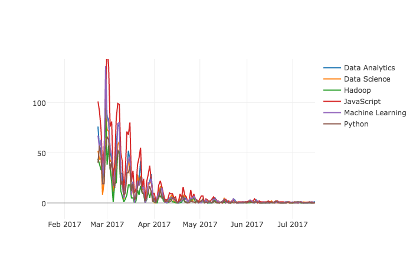
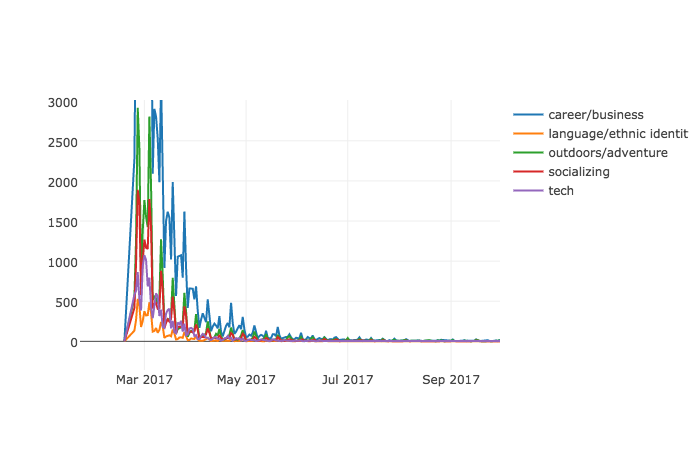
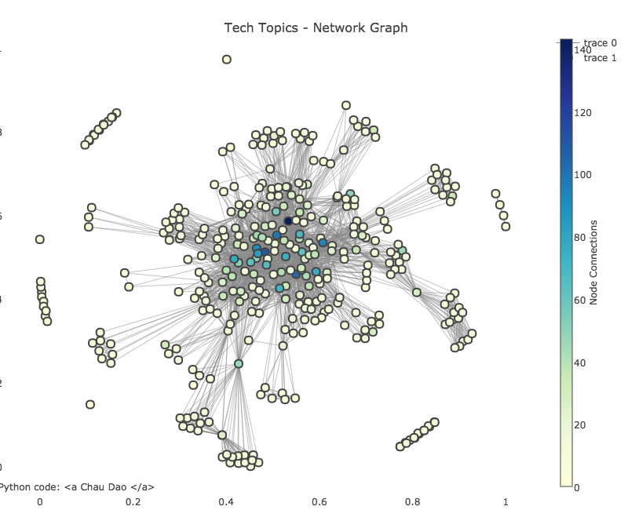
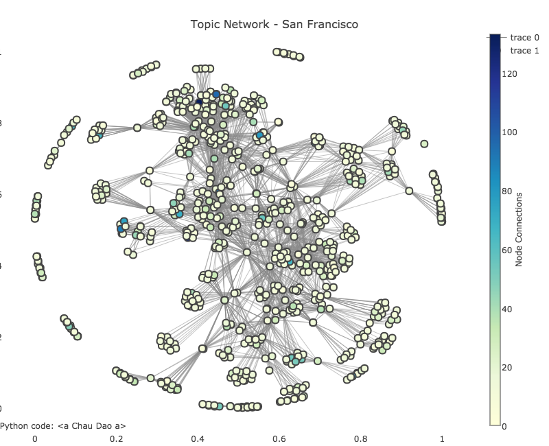

# 
 PROJECT  OBJECTIVES 

- Built a production-ready streaming and predicting pipeline using MeetupAPI and AWS
- Predicted in real-time the next industry-specific trend and tracked its popularity over time through
interactive time-series graphs 
- Discovered the emergence of a new community (category) in a city using Network Graphs
- Implementing Time Series to see the rise of a topic and how different topics evolve over time

# 
 PROCEDURES 

# 
 ETL 

#Example of raw rsvp streaming file

#Please view [[ipython](https://github.com/Charlotte1904/MeetupAPI/blob/master/README.ipynb)] for more information.

 #  
 VISUALIZATION 

----

http://meetupfinalgraphs.s3-website-us-west-1.amazonaws.com/
#
 Category Distribution - San Francisco 

---

#  
 TIME SERIES 

---

<h3> Top Trending Topics -  San Francisco </h3>

 

<h3> DataScience Topics - San Francisco </h3>

 

<h3> Labled-Category Groups </h3>

#  
 NETWORK GRAPH 

---

<h3> Tech-Topic Network -  San Francisco </h3>

---

<h3> Topic Network - San Francisco </h3>

