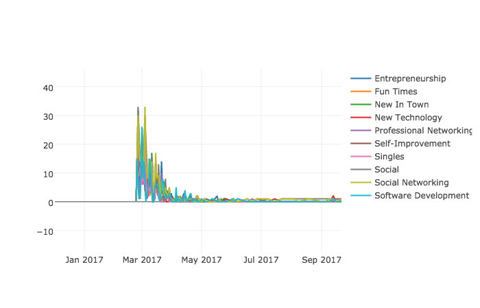
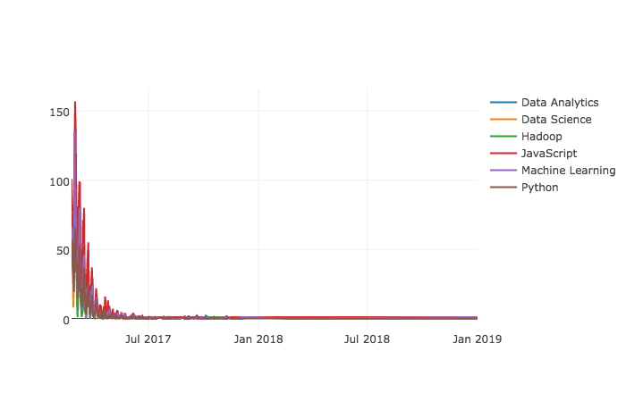

# 
 MEETUP PLATFORM 

-**Using MeetupAPI to explore the relationships among topics to discern different sub-category within a category** 
 
-**Implementing Network Graph to discover the new emergence tech community and/or new tool within a category**
 
-**Implementing Time Series to see the rise of a topic and how different topics evolve over time**

#Example of raw rsvp streaming file

#Please view [[ipython](https://github.com/Charlotte1904/MeetupAPI/blob/master/README.ipynb)] for more information.

 #  
 VISUALIZATION 

----

http://meetupfinalgraphs.s3-website-us-west-1.amazonaws.com/
#
 Category Distribution - San Francisco 

---

#  
 TIME SERIES 

---

<h3> Top Trending Topics -  San Francisco </h3>

<h3> DataScience Topics - San Francisco </h3>

<h3> Labled-Category Groups </h3>

#  
 NETWORK GRAPH 

---

<h3> Tech-Topic Network -  San Francisco </h3>

---

<h3> Topic Network - San Francisco </h3>

